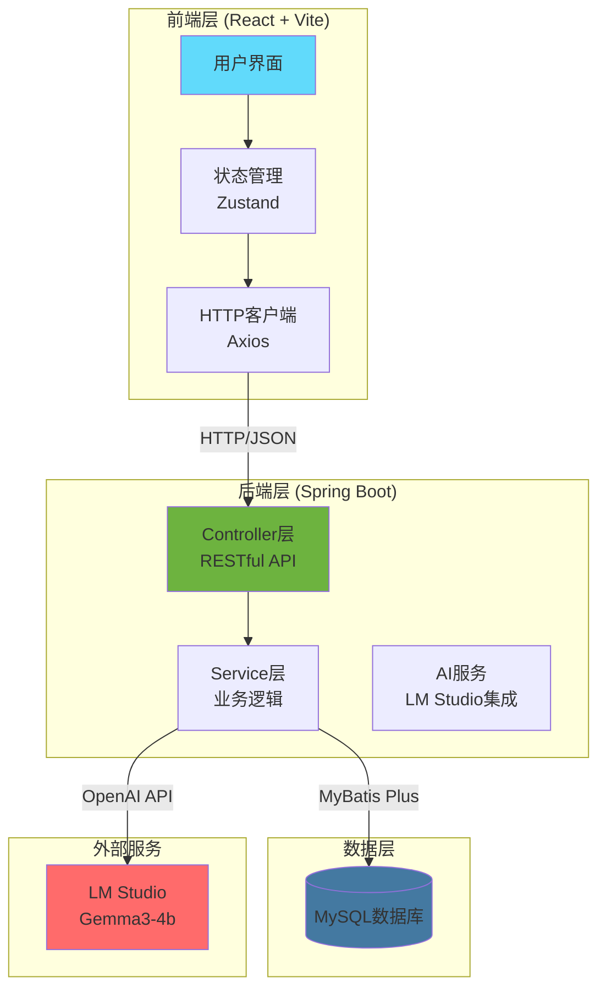
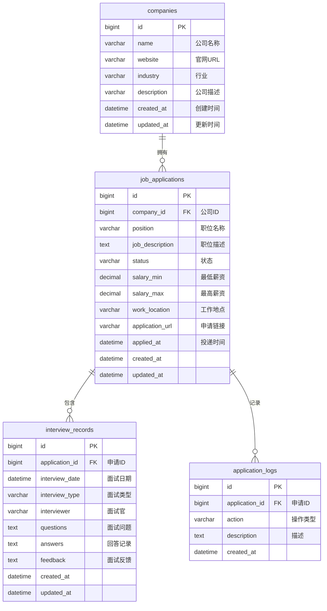
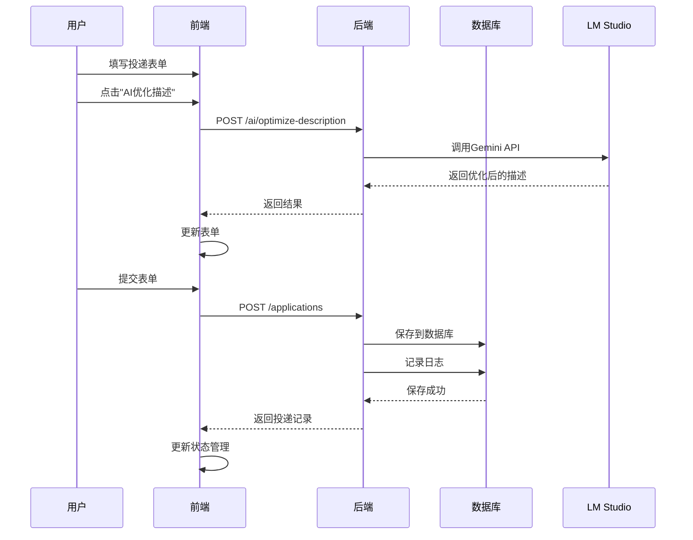

# DESIGN - 求职追踪应用架构设计

## 📐 系统架构图



---

## 🗄️ 数据库设计

### ER 图



### 表结构详细定义

#### 1. companies (公司表)
```sql
CREATE TABLE companies (
    id BIGINT PRIMARY KEY AUTO_INCREMENT COMMENT '公司ID',
    name VARCHAR(200) NOT NULL COMMENT '公司名称',
    website VARCHAR(500) COMMENT '招聘官网URL',
    industry VARCHAR(100) COMMENT '所属行业',
    description TEXT COMMENT '公司描述',
    created_at DATETIME DEFAULT CURRENT_TIMESTAMP COMMENT '创建时间',
    updated_at DATETIME DEFAULT CURRENT_TIMESTAMP ON UPDATE CURRENT_TIMESTAMP COMMENT '更新时间',
    INDEX idx_name (name)
) ENGINE=InnoDB DEFAULT CHARSET=utf8mb4 COMMENT='公司信息表';
```

#### 2. job_applications (投递记录表)
```sql
CREATE TABLE job_applications (
    id BIGINT PRIMARY KEY AUTO_INCREMENT COMMENT '投递ID',
    company_id BIGINT NOT NULL COMMENT '公司ID',
    position VARCHAR(200) NOT NULL COMMENT '职位名称',
    job_description TEXT COMMENT '职位描述',
    status VARCHAR(50) DEFAULT 'APPLIED' COMMENT '状态：APPLIED/RESUME_SCREENING/INTERVIEWING/OFFER/REJECTED',
    salary_min DECIMAL(10,2) COMMENT '最低薪资',
    salary_max DECIMAL(10,2) COMMENT '最高薪资',
    work_location VARCHAR(200) COMMENT '工作地点',
    application_url VARCHAR(1000) COMMENT '申请链接',
    applied_at DATETIME COMMENT '投递时间',
    created_at DATETIME DEFAULT CURRENT_TIMESTAMP,
    updated_at DATETIME DEFAULT CURRENT_TIMESTAMP ON UPDATE CURRENT_TIMESTAMP,
    FOREIGN KEY (company_id) REFERENCES companies(id) ON DELETE CASCADE,
    INDEX idx_status (status),
    INDEX idx_applied_at (applied_at)
) ENGINE=InnoDB DEFAULT CHARSET=utf8mb4 COMMENT='求职申请表';
```

#### 3. interview_records (面试记录表)
```sql
CREATE TABLE interview_records (
    id BIGINT PRIMARY KEY AUTO_INCREMENT COMMENT '面试记录ID',
    application_id BIGINT NOT NULL COMMENT '申请ID',
    interview_date DATETIME NOT NULL COMMENT '面试日期',
    interview_type VARCHAR(50) COMMENT '面试类型：VIDEO/ONSITE/PHONE',
    interviewer VARCHAR(200) COMMENT '面试官',
    questions TEXT COMMENT '面试问题（JSON）',
    answers TEXT COMMENT '回答记录',
    feedback TEXT COMMENT '面试反馈',
    created_at DATETIME DEFAULT CURRENT_TIMESTAMP,
    updated_at DATETIME DEFAULT CURRENT_TIMESTAMP ON UPDATE CURRENT_TIMESTAMP,
    FOREIGN KEY (application_id) REFERENCES job_applications(id) ON DELETE CASCADE,
    INDEX idx_interview_date (interview_date)
) ENGINE=InnoDB DEFAULT CHARSET=utf8mb4 COMMENT='面试记录表';
```

#### 4. application_logs (状态变更日志表)
```sql
CREATE TABLE application_logs (
    id BIGINT PRIMARY KEY AUTO_INCREMENT COMMENT '日志ID',
    application_id BIGINT NOT NULL COMMENT '申请ID',
    action VARCHAR(100) NOT NULL COMMENT '操作类型',
    description TEXT COMMENT '描述',
    created_at DATETIME DEFAULT CURRENT_TIMESTAMP COMMENT '创建时间',
    FOREIGN KEY (application_id) REFERENCES job_applications(id) ON DELETE CASCADE,
    INDEX idx_application_id (application_id),
    INDEX idx_created_at (created_at)
) ENGINE=InnoDB DEFAULT CHARSET=utf8mb4 COMMENT='申请日志表';
```

---

## 🔌 RESTful API 设计

### 基础路径
```
http://localhost:8080/api/v1
```

### API 端点列表

#### 1. 公司管理
| 方法 | 路径 | 描述 |
|------|------|------|
| GET | /companies | 获取所有公司 |
| POST | /companies | 创建公司 |
| GET | /companies/{id} | 获取公司详情 |
| PUT | /companies/{id} | 更新公司 |
| DELETE | /companies/{id} | 删除公司 |

#### 2. 投递管理
| 方法 | 路径 | 描述 |
|------|------|------|
| GET | /applications | 获取所有投递（支持状态筛选） |
| POST | /applications | 创建投递记录 |
| GET | /applications/{id} | 获取投递详情 |
| PUT | /applications/{id} | 更新投递记录 |
| DELETE | /applications/{id} | 删除投递记录 |
| PUT | /applications/{id}/status | 更新投递状态 |
| GET | /applications/{id}/logs | 获取投递日志 |

#### 3. 面试记录
| 方法 | 路径 | 描述 |
|------|------|------|
| GET | /applications/{id}/interviews | 获取投递的面试记录 |
| POST | /applications/{id}/interviews | 创建面试记录 |
| PUT | /interviews/{id} | 更新面试记录 |
| DELETE | /interviews/{id} | 删除面试记录 |

#### 4. AI 辅助
| 方法 | 路径 | 描述 |
|------|------|------|
| POST | /ai/optimize-description | 优化职位描述 |
| POST | /ai/generate-cover-letter | 生成求职信 |
| POST | /ai/generate-interview-qa | 生成面试问题 |

#### 5. 数据导出
| 方法 | 路径 | 描述 |
|------|------|------|
| GET | /export/csv | 导出为 CSV |
| GET | /export/json | 导出为 JSON |

---

## 🎨 前端页面结构

```
src/
├── pages/                      # 页面组件
│   ├── Dashboard.tsx           # 仪表盘（状态看板）
│   ├── Applications.tsx        # 投递列表
│   ├── ApplicationDetail.tsx   # 投递详情
│   ├── ApplicationForm.tsx     # 新建/编辑投递
│   ├── InterviewCalendar.tsx   # 面试日历
│   ├── CompanyManage.tsx       # 公司管理
│   └── Settings.tsx            # 设置（AI配置等）
│
├── components/                 # 通用组件
│   ├── ui/                     # shadcn/ui 组件
│   ├── ApplicationCard.tsx     # 投递卡片
│   ├── StatusBadge.tsx         # 状态标签
│   ├── Timeline.tsx            # 时间线
│   ├── AITextarea.tsx          # AI辅助输入框
│   └── StatCard.tsx            # 统计卡片
│
├── store/                      # 状态管理
│   ├── applicationStore.ts     # 投递状态
│   ├── companyStore.ts         # 公司状态
│   └── uiStore.ts              # UI状态
│
├── services/                   # API服务
│   ├── api.ts                  # Axios配置
│   ├── applicationService.ts   # 投递API
│   ├── companyService.ts       # 公司API
│   ├── interviewService.ts     # 面试API
│   └── aiService.ts            # AI服务API
│
├── types/                      # TypeScript类型
│   ├── application.ts
│   ├── company.ts
│   └── interview.ts
│
└── utils/                      # 工具函数
    ├── formatters.ts           # 格式化函数
    └── validators.ts           # 验证函数
```

---

## 🏗️ 后端项目结构

```
job-tracker-backend/
├── src/main/java/com/jobtracker/
│   ├── controller/             # 控制器层
│   │   ├── CompanyController.java
│   │   ├── ApplicationController.java
│   │   ├── InterviewController.java
│   │   └── AIController.java
│   │
│   ├── service/                # 服务层
│   │   ├── CompanyService.java
│   │   ├── ApplicationService.java
│   │   ├── InterviewService.java
│   │   └── AIService.java
│   │
│   ├── mapper/                 # MyBatis Mapper
│   │   ├── CompanyMapper.java
│   │   ├── ApplicationMapper.java
│   │   └── InterviewMapper.java
│   │
│   ├── entity/                 # 实体类
│   │   ├── Company.java
│   │   ├── JobApplication.java
│   │   ├── InterviewRecord.java
│   │   └── ApplicationLog.java
│   │
│   ├── dto/                    # 数据传输对象
│   │   ├── request/
│   │   └── response/
│   │
│   ├── config/                 # 配置类
│   │   ├── MybatisPlusConfig.java
│   │   ├── CorsConfig.java
│   │   └── AIConfig.java
│   │
│   └── common/                 # 通用组件
│       ├── result/             # 统一响应
│       └── exception/          # 异常处理
│
└── resources/
    ├── application.yml         # 应用配置
    └── mapper/                 # MyBatis XML
```

---

## 🔗 数据流设计

### 投递创建流程


---

## 🔐 安全与配置

### 环境变量
```bash
# 数据库配置
DB_HOST=localhost
DB_PORT=3306
DB_NAME=job_tracker
DB_USER=root
DB_PASSWORD=your_password

# AI服务配置
AI_API_URL=http://localhost:1234/v1
AI_API_KEY=sk-lm-studio
AI_MODEL=gemma-3-4b-it

# CORS配置
CORS_ALLOWED_ORIGINS=http://localhost:5173
```

---

## 📊 统计分析功能

### 仪表盘指标
- 总投递数
- 各状态投递数量
- 本月投递趋势
- 面试转化率
- 平均面试轮次
- 公司类型分布

---

## 🔄 文档同步

本文档内容已同步至项目主文档 `说明文档.md`
