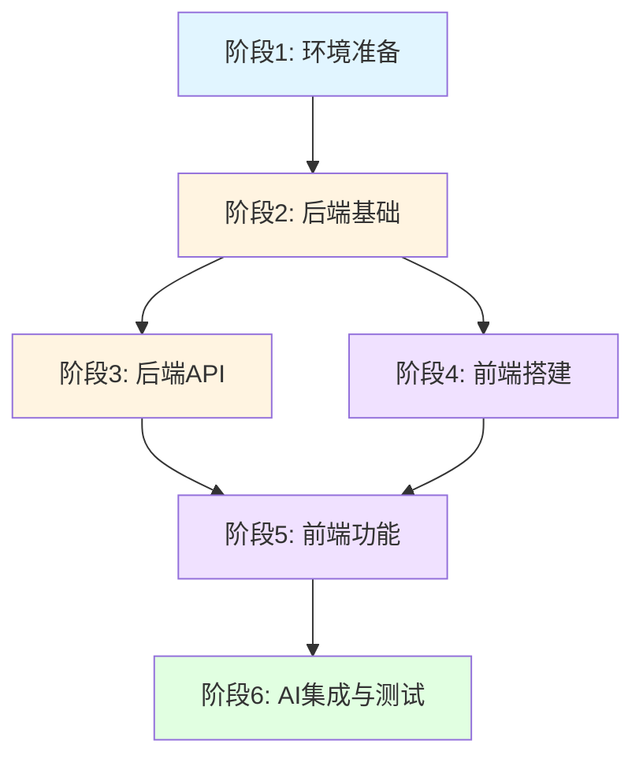

# TASK - 求职追踪应用任务拆分

## 📋 任务依赖图



---

## 🚀 阶段 1：环境准备与项目初始化

### 1.1 数据库环境准备
**输入契约**：MySQL 8.0+ 已安装
**输出契约**：数据库创建成功，表结构初始化完成

**任务清单**：
- [ ] 创建数据库 `job_tracker`
- [ ] 创建用户并授权（可选）
- [ ] 执行建表 SQL（4张表：companies, job_applications, interview_records, application_logs）
- [ ] 验证表结构正确性

**验收标准**：
- 数据库连接正常
- 所有表创建成功
- 外键约束生效

**预计耗时**：30分钟

---

### 1.2 后端项目初始化
**输入契约**：JDK 17+ 已安装
**输出契约**：Spring Boot 项目可正常启动

**任务清单**：
- [ ] 创建 Spring Boot 项目（使用 Spring Initializr 或 Maven）
- [ ] 添加依赖：
  - spring-boot-starter-web
  - spring-boot-starter-validation
  - mybatis-plus-spring-boot3-starter
  - mysql-connector-j
  - lombok
  - jjwt (可选，暂不需要)
- [ ] 配置 application.yml（数据库连接、CORS、AI服务地址）
- [ ] 创建项目目录结构（controller/service/mapper/entity/dto/config/common）
- [ ] 编写主启动类，验证启动成功

**验收标准**：
- 项目可正常编译
- 启动端口 8080 可访问
- 日志无错误

**预计耗时**：1小时

---

### 1.3 前端项目初始化
**输入契约**：Node.js 18+ 已安装
**输出契约**：React + Vite 项目可正常启动

**任务清单**：
- [ ] 使用 Vite 创建 React + TypeScript 项目
- [ ] 安装依赖：
  - tailwindcss + postcss + autoprefixer
  - react-router-dom
  - zustand
  - axios
  - dayjs
  - lucide-react (图标库)
- [ ] 配置 Tailwind CSS
- [ ] 安装 shadcn/ui 并初始化
- [ ] 创建项目目录结构（pages/components/store/services/types/utils）
- [ ] 配置路由结构
- [ ] 创建 Zustand stores（application/company/ui）
- [ ] 验证项目启动（端口 5173）

**验收标准**：
- npm run dev 启动成功
- shadcn/ui 组件可正常导入使用
- Tailwind 样式生效

**预计耗时**：1.5小时

---

## 🔧 阶段 2：后端基础（数据库层）

### 2.1 创建实体类（Entity）
**输入契约**：数据库表结构已确定
**输出契约**：所有实体类创建完成

**任务清单**：
- [ ] `Company.java` - 公司实体
  - 字段：id, name, website, industry, description, createdAt, updatedAt
  - Lombok 注解：@Data, @TableName, @TableField
- [ ] `JobApplication.java` - 投递实体
  - 字段：id, companyId, position, jobDescription, status, salaryMin, salaryMax, workLocation, applicationUrl, appliedAt
  - 关联注解
- [ ] `InterviewRecord.java` - 面试记录实体
  - 字段：id, applicationId, interviewDate, interviewType, interviewer, questions, answers, feedback
- [ ] `ApplicationLog.java` - 日志实体
  - 字段：id, applicationId, action, description, createdAt

**验收标准**：
- 所有实体类字段与数据库表一一对应
- 使用 Lombok 简化代码
- 添加必要的 Javadoc 注释

**预计耗时**：1小时

---

### 2.2 创建 DTO 类
**输入契约**：实体类已创建
**输出契约**：请求和响应 DTO 创建完成

**任务清单**：
- [ ] 创建 request 包：
  - `CompanyCreateRequest.java`
  - `CompanyUpdateRequest.java`
  - `ApplicationCreateRequest.java`
  - `ApplicationUpdateRequest.java`
  - `InterviewCreateRequest.java`
  - `AIOptimizeRequest.java`
- [ ] 创建 response 包：
  - `CompanyResponse.java`
  - `ApplicationResponse.java`
  - `InterviewResponse.java`
  - `ApplicationDetailResponse.java`
  - `DashboardStatsResponse.java`
- [ ] 添加 @Valid 注解和验证规则

**验收标准**：
- DTO 字段完整
- 验证注解正确（@NotNull, @NotBlank, @Size 等）
- 包含必要的 Javadoc

**预计耗时**：1.5小时

---

### 2.3 创建 Mapper 接口
**输入契约**：实体类已创建
**输出契约**：所有 Mapper 接口创建完成

**任务清单**：
- [ ] `CompanyMapper.java` - 继承 BaseMapper<Company>
- [ ] `ApplicationMapper.java` - 继承 BaseMapper<JobApplication>
  - 自定义方法：selectWithCompany()
- [ ] `InterviewMapper.java` - 继承 BaseMapper<InterviewRecord>
- [ ] `ApplicationLogMapper.java` - 继承 BaseMapper<ApplicationLog>

**验收标准**：
- 继承 MyBatis Plus BaseMapper
- 复杂查询方法添加 @Select 注解
- Mapper 扫描配置正确

**预计耗时**：30分钟

---

### 2.4 配置类创建
**输入契约**：Spring Boot 项目已初始化
**输出契约**：所有配置类创建完成

**任务清单**：
- [ ] `MybatisPlusConfig.java` - MyBatis Plus 配置
  - 分页插件
  - 乐观锁插件（可选）
- [ ] `CorsConfig.java` - 跨域配置
  - 允许前端地址 http://localhost:5173
- [ ] `AIConfig.java` - AI 服务配置
  - LM Studio API 地址配置
  - RestTemplate Bean
- [ ] `GlobalExceptionHandler.java` - 全局异常处理

**验收标准**：
- 跨域请求正常
- 分页查询可用
- 异常统一处理

**预计耗时**：1小时

---

## 🔌 阶段 3：后端 API 开发

### 3.1 公司管理 API
**输入契约**：Mapper 和 DTO 已创建
**输出契约**：公司 CRUD 接口完成

**任务清单**：
- [ ] `CompanyService.java` - 服务层
  - createCompany() - 创建公司
  - getAllCompanies() - 获取所有公司
  - getCompanyById() - 获取详情
  - updateCompany() - 更新公司
  - deleteCompany() - 删除公司
- [ ] `CompanyController.java` - 控制器层
  - GET /api/v1/companies
  - POST /api/v1/companies
  - GET /api/v1/companies/{id}
  - PUT /api/v1/companies/{id}
  - DELETE /api/v1/companies/{id}
- [ ] 单元测试（可选）

**验收标准**：
- 所有接口可正常调用
- 返回统一格式（Result<T>）
- 参数验证生效

**预计耗时**：2小时

---

### 3.2 投递管理 API
**输入契约**：公司和应用 Mapper 已创建
**输出契约**：投递 CRUD 接口完成

**任务清单**：
- [ ] `ApplicationService.java` - 服务层
  - createApplication() - 创建投递
  - getAllApplications() - 获取列表（支持状态筛选）
  - getApplicationDetail() - 获取详情（含公司信息）
  - updateApplication() - 更新投递
  - deleteApplication() - 删除投递
  - updateStatus() - 更新状态（并记录日志）
  - getApplicationLogs() - 获取日志
- [ ] `ApplicationController.java` - 控制器层
  - GET /api/v1/applications
  - POST /api/v1/applications
  - GET /api/v1/applications/{id}
  - PUT /api/v1/applications/{id}
  - DELETE /api/v1/applications/{id}
  - PUT /api/v1/applications/{id}/status
  - GET /api/v1/applications/{id}/logs

**验收标准**：
- 状态更新时自动记录日志
- 支持按状态筛选
- 详情包含公司信息

**预计耗时**：3小时

---

### 3.3 面试记录 API
**输入契约**：InterviewMapper 已创建
**输出契约**：面试 CRUD 接口完成

**任务清单**：
- [ ] `InterviewService.java` - 服务层
  - createInterview() - 创建面试记录
  - getInterviewsByApplicationId() - 获取投递的所有面试
  - updateInterview() - 更新面试记录
  - deleteInterview() - 删除面试记录
- [ ] `InterviewController.java` - 控制器层
  - GET /api/v1/applications/{id}/interviews
  - POST /api/v1/applications/{id}/interviews
  - PUT /api/v1/interviews/{id}
  - DELETE /api/v1/interviews/{id}

**验收标准**：
- 面试记录关联到投递
- 支持多个面试记录

**预计耗时**：1.5小时

---

### 3.4 AI 辅助 API
**输入契约**：LM Studio 已启动
**输出契约**：AI 辅助接口完成

**任务清单**：
- [ ] `AIService.java` - 服务层
  - `callLLM()` - 调用 LM Studio API（私有方法）
  - `optimizeDescription()` - 优化职位描述
  - `generateCoverLetter()` - 生成求职信
  - `generateInterviewQA()` - 生成面试问题和答案
- [ ] `AIController.java` - 控制器层
  - POST /api/v1/ai/optimize-description
  - POST /api/v1/ai/generate-cover-letter
  - POST /api/v1/ai/generate-interview-qa

**Prompt 模板**：
```java
// 优化职位描述
"请根据以下公司名称和职位，生成一份专业的职位描述（100-200字）：
公司：%s
职位：%s
要求：突出职位职责、任职要求和公司特色。"

// 生成求职信
"请为以下职位生成一份求职信（200-300字）：
公司：%s
职位：%s
职位描述：%s
要求：语气专业，突出匹配度，表达求职意愿。"

// 生成面试问题
"请为以下职位生成5个可能的面试问题和参考答案：
公司：%s
职位：%s
职位描述：%s
要求：问题涵盖技术能力、项目经验、行为面试等维度。"
```

**验收标准**：
- 可正常调用 LM Studio API
- 返回结果格式正确
- 错误处理完善

**预计耗时**：2小时

---

### 3.5 统计分析 API
**输入契约**：ApplicationMapper 已创建
**输出契约**：统计数据接口完成

**任务清单**：
- [ ] `DashboardService.java` - 服务层
  - getStats() - 获取仪表盘统计数据
  - getStatusDistribution() - 各状态投递数量
  - getMonthlyTrend() - 月度投递趋势
  - getConversionRate() - 面试转化率
- [ ] `DashboardController.java` - 控制器层
  - GET /api/v1/dashboard/stats

**验收标准**：
- 统计数据准确
- 返回格式符合前端需求

**预计耗时**：1.5小时

---

## 🎨 阶段 4：前端项目搭建

### 4.1 创建基础布局
**输入契约**：前端项目已初始化
**输出契约**：应用基础布局完成

**任务清单**：
- [ ] 创建 `Layout.tsx` - 主布局组件
  - 顶部导航栏
  - 侧边栏菜单
  - 内容区域
- [ ] 创建路由配置
  - / - 仪表盘
  - /applications - 投递列表
  - /applications/new - 新建投递
  - /applications/:id - 投递详情
  - /companies - 公司管理
  - /interviews - 面试日历
  - /settings - 设置
- [ ] 创建 `App.tsx` - 应用入口
- [ ] 添加页面过渡动画（可选）

**验收标准**：
- 路由跳转正常
- 布局响应式适配
- 导航栏菜单可点击

**预计耗时**：2小时

---

### 4.2 创建通用组件
**输入契约**：shadcn/ui 已安装
**输出契约**：通用组件库完成

**任务清单**：
- [ ] `StatusBadge.tsx` - 状态标签
  - 颜色：已投递(蓝) 筛选中(黄) 面试中(紫) 已offer(绿) 已拒绝(红)
- [ ] `ApplicationCard.tsx` - 投递卡片
  - 显示：公司名、职位、状态、日期、薪资
  - 操作：查看详情、编辑、删除
- [ ] `StatCard.tsx` - 统计卡片
  - 显示：图标、标题、数值、变化趋势
- [ ] `Timeline.tsx` - 时间线组件
  - 显示：投递历程节点
- [ ] `AITextarea.tsx` - AI 辅助输入框
  - 功能：输入框 + AI 优化按钮

**验收标准**：
- 组件可复用
- Props 类型定义完整
- 样式统一

**预计耗时**：3小时

---

### 4.3 配置 API 服务
**输入契约**：Axios 已安装
**输出契约**：API 服务层完成

**任务清单**：
- [ ] `services/api.ts` - Axios 实例配置
  - baseURL: http://localhost:8080/api/v1
  - 请求拦截器（添加 token，暂不需要）
  - 响应拦截器（错误处理）
- [ ] `services/companyService.ts` - 公司 API
- [ ] `services/applicationService.ts` - 投递 API
- [ ] `services/interviewService.ts` - 面试 API
- [ ] `services/aiService.ts` - AI API
- [ ] `services/dashboardService.ts` - 统计 API

**验收标准**：
- 所有 API 方法封装完成
- 类型定义正确
- 错误处理统一

**预计耗时**：1.5小时

---

## 💻 阶段 5：前端功能开发

### 5.1 仪表盘页面
**输入契约**：统计 API 已完成
**输出契约**：仪表盘页面完成

**任务清单**：
- [ ] `Dashboard.tsx` - 仪表盘组件
  - 顶部：4个统计卡片（总投递、面试中、已offer、本月新增）
  - 中部：状态分布图表（使用 Chart.js 或 Recharts）
  - 底部：最近投递列表
- [ ] 调用 dashboardService.getStats()
- [ ] 数据可视化展示

**验收标准**：
- 统计数据正确显示
- 图表渲染正常
- 支持点击跳转到详情

**预计耗时**：3小时

---

### 5.2 投递列表页面
**输入契约**：投递 API 已完成
**输出契约**：投递列表页面完成

**任务清单**：
- [ ] `Applications.tsx` - 投递列表组件
  - 顶部：搜索框、状态筛选、新建按钮
  - 内容：卡片列表或表格
  - 支持按状态筛选
  - 支持按公司名/职位搜索
- [ ] 状态筛选器
- [ ] 分页加载（可选）

**验收标准**：
- 列表数据正确显示
- 筛选功能正常
- 卡片操作（编辑/删除）可用

**预计耗时**：2.5小时

---

### 5.3 投递详情页面
**输入契约**：投递和面试 API 已完成
**输出契约**：投递详情页面完成

**任务清单**：
- [ ] `ApplicationDetail.tsx` - 详情组件
  - 顶部：基本信息卡片
  - 中部：状态时间线
  - 底部：面试记录列表
  - 操作：编辑投递、添加面试记录
- [ ] 调用 getApplicationDetail()
- [ ] 调用 getInterviewsByApplicationId()

**验收标准**：
- 详情信息完整
- 时间线显示正确
- 面试记录可查看

**预计耗时**：2.5小时

---

### 5.4 投递表单页面
**输入契约**：公司和投递 API 已完成
**输出契约**：新建/编辑表单完成

**任务清单**：
- [ ] `ApplicationForm.tsx` - 表单组件
  - 公司选择（支持搜索已有公司或新建）
  - 职位输入
  - 职位描述（支持 AI 优化）
  - 薪资范围
  - 工作地点
  - 申请链接
  - 投递日期
  - 提交按钮
- [ ] 表单验证
- [ ] 调用 AI 优化接口

**验收标准**：
- 表单验证生效
- AI 优化功能正常
- 提交成功后跳转

**预计耗时**：3小时

---

### 5.5 公司管理页面
**输入契约**：公司 API 已完成
**输出契约**：公司管理页面完成

**任务清单**：
- [ ] `CompanyManage.tsx` - 公司管理组件
  - 顶部：搜索、新建按钮
  - 内容：公司列表（表格）
  - 列：公司名、行业、官网、操作
  - 操作：编辑、删除
- [ ] `CompanyForm.tsx` - 公司表单（对话框）
  - 公司名
  - 行业
  - 官网 URL
  - 描述

**验收标准**：
- 公司列表正常显示
- 新增/编辑功能正常
- 支持搜索

**预计耗时**：2小时

---

### 5.6 面试记录功能
**输入契约**：面试 API 已完成
**输出契约**：面试记录功能完成

**任务清单**：
- [ ] `InterviewForm.tsx` - 面试表单（对话框）
  - 面试日期
  - 面试类型（下拉选择）
  - 面试官
  - 面试问题（支持 AI 生成）
  - 回答记录
  - 反馈总结
- [ ] 集成到投递详情页面
- [ ] AI 生成面试问题功能

**验收标准**：
- 表单验证生效
- AI 生成功能正常
- 面试记录保存成功

**预计耗时**：2小时

---

### 5.7 设置页面
**输入契约**：无
**输出契约**：设置页面完成

**任务清单**：
- [ ] `Settings.tsx` - 设置组件
  - AI 服务配置
    - API 地址
    - 模型名称
  - 测试连接按钮
  - 保存配置（localStorage）

**验收标准**：
- 配置可保存
- 测试连接功能正常

**预计耗时**：1小时

---

## 🤖 阶段 6：AI 集成与测试

### 6.1 AI 功能集成测试
**输入契约**：AI API 已完成，LM Studio 已启动
**输出契约**：AI 功能正常工作

**任务清单**：
- [ ] 启动 LM Studio，加载 Gemma3-4b 模型
- [ ] 启动 API Server（默认端口 1234）
- [ ] 测试职位描述优化
- [ ] 测试求职信生成
- [ ] 测试面试问题生成
- [ ] 错误处理测试（API 不可用时）

**验收标准**：
- 所有 AI 功能正常调用
- 返回结果符合预期
- 错误提示友好

**预计耗时**：1.5小时

---

### 6.2 端到端测试
**输入契约**：所有功能已完成
**输出契约**：应用整体流程可正常使用

**测试场景**：
- [ ] 场景1：创建公司 → 创建投递 → 更新状态 → 添加面试记录
- [ ] 场景2：使用 AI 优化职位描述
- [ ] 场景3：使用 AI 生成求职信
- [ ] 场景4：查看仪表盘统计数据
- [ ] 场景5：搜索和筛选投递记录

**验收标准**：
- 所有场景可顺利完成
- 数据一致性正确
- 无明显 Bug

**预计耗时**：2小时

---

### 6.3 数据导出功能（可选）
**输入契约**：后端 API 已完成
**输出契约**：数据可导出

**任务清单**：
- [ ] 后端：实现 CSV 和 JSON 导出 API
- [ ] 前端：添加导出按钮
- [ ] 测试导出功能

**验收标准**：
- 导出文件格式正确
- 数据完整

**预计耗时**：1小时

---

### 6.4 部署准备
**输入契约**：应用已测试通过
**输出契约**：部署文档完成

**任务清单**：
- [ ] 编写 README.md
  - 项目介绍
  - 功能说明
  - 快速开始
  - 环境要求
- [ ] 创建数据库初始化脚本 `init.sql`
- [ ] 创建前端环境变量示例 `.env.example`
- [ ] 创建后端配置示例 `application-example.yml`
- [ ] 编写部署文档（可选）

**验收标准**：
- 文档完整清晰
- 新开发者可按文档快速启动

**预计耗时**：1小时

---

## 📊 总计时间估算

| 阶段 | 预计耗时 |
|------|---------|
| 阶段1：环境准备与项目初始化 | 3小时 |
| 阶段2：后端基础 | 5小时 |
| 阶段3：后端 API 开发 | 10.5小时 |
| 阶段4：前端项目搭建 | 6.5小时 |
| 阶段5：前端功能开发 | 15.5小时 |
| 阶段6：AI 集成与测试 | 5.5小时 |
| **总计** | **46小时** |

---

## 🎯 关键里程碑

- [ ] **里程碑1**：后端 API 全部完成（阶段1-3）
- [ ] **里程碑2**：前端基础和组件完成（阶段4）
- [ ] **里程碑3**：核心功能页面完成（阶段5）
- [ ] **里程碑4**：AI 集成和测试完成（阶段6）
- [ ] **里程碑5**：项目交付（部署准备完成）

---

## 🔄 文档同步

本文档内容已同步至项目主文档 `说明文档.md`

---

*最后更新时间：2026-03-11*
