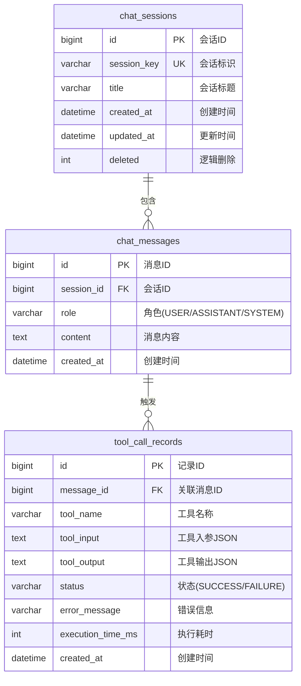

# AI对话持久化设计方案

**文档版本**: 1.0
**创建日期**: 2026-03-13
**维护者**: Backend Team

---

## 一、问题分析

### 1.1 当前问题

- 用户每次刷新页面，AI对话历史丢失
- 无法查看历史对话记录
- 无法追溯AI的工具有效性
- 会话状态仅保存在内存中（ChatMemoryManager）

### 1.2 目标

- 持久化保存用户与AI的对话记录
- 记录AI调用的工具及结果
- 支持多会话管理
- 支持历史对话查询

---

## 二、数据库设计

### 2.1 ER图



### 2.2 表结构SQL

```sql
-- 会话表
CREATE TABLE chat_sessions (
    id BIGINT PRIMARY KEY AUTO_INCREMENT COMMENT '会话ID',
    session_key VARCHAR(100) NOT NULL UNIQUE COMMENT '会话唯一标识',
    title VARCHAR(200) COMMENT '会话标题（可AI生成）',
    message_count INT DEFAULT 0 COMMENT '消息数量',
    created_at DATETIME DEFAULT CURRENT_TIMESTAMP COMMENT '创建时间',
    updated_at DATETIME DEFAULT CURRENT_TIMESTAMP ON UPDATE CURRENT_TIMESTAMP COMMENT '更新时间',
    deleted INT DEFAULT 0 COMMENT '逻辑删除',
    INDEX idx_session_key (session_key),
    INDEX idx_created_at (created_at)
) ENGINE=InnoDB DEFAULT CHARSET=utf8mb4 COMMENT='聊天会话表';

-- 消息表
CREATE TABLE chat_messages (
    id BIGINT PRIMARY KEY AUTO_INCREMENT COMMENT '消息ID',
    session_id BIGINT NOT NULL COMMENT '会话ID',
    role VARCHAR(20) NOT NULL COMMENT '角色: USER/ASSISTANT/SYSTEM',
    content TEXT NOT NULL COMMENT '消息内容',
    created_at DATETIME DEFAULT CURRENT_TIMESTAMP COMMENT '创建时间',
    FOREIGN KEY (session_id) REFERENCES chat_sessions(id) ON DELETE CASCADE,
    INDEX idx_session_id (session_id),
    INDEX idx_created_at (created_at)
) ENGINE=InnoDB DEFAULT CHARSET=utf8mb4 COMMENT='聊天消息表';

-- 工具调用记录表
CREATE TABLE tool_call_records (
    id BIGINT PRIMARY KEY AUTO_INCREMENT COMMENT '记录ID',
    message_id BIGINT NOT NULL COMMENT '关联的AI消息ID',
    tool_name VARCHAR(100) NOT NULL COMMENT '工具名称',
    tool_input TEXT COMMENT '工具入参(JSON)',
    tool_output TEXT COMMENT '工具输出(JSON)',
    status VARCHAR(20) NOT NULL DEFAULT 'SUCCESS' COMMENT '状态: SUCCESS/FAILURE',
    error_message TEXT COMMENT '错误信息',
    execution_time_ms INT COMMENT '执行耗时(毫秒)',
    created_at DATETIME DEFAULT CURRENT_TIMESTAMP COMMENT '创建时间',
    FOREIGN KEY (message_id) REFERENCES chat_messages(id) ON DELETE CASCADE,
    INDEX idx_message_id (message_id),
    INDEX idx_tool_name (tool_name)
) ENGINE=InnoDB DEFAULT CHARSET=utf8mb4 COMMENT='工具调用记录表';
```

---

## 三、实体类设计

### 3.1 ChatSession

```java
@Data
@TableName("chat_sessions")
public class ChatSession implements Serializable {

    @TableId(value = "id", type = IdType.AUTO)
    private Long id;

    /** 会话唯一标识 */
    @TableField("session_key")
    private String sessionKey;

    /** 会话标题 */
    private String title;

    /** 消息数量 */
    @TableField("message_count")
    private Integer messageCount;

    @TableField(value = "created_at", fill = FieldFill.INSERT)
    private LocalDateTime createdAt;

    @TableField(value = "updated_at", fill = FieldFill.INSERT_UPDATE)
    private LocalDateTime updatedAt;

    @TableLogic
    private Integer deleted;
}
```

### 3.2 ChatMessage

```java
@Data
@TableName("chat_messages")
public class ChatMessage implements Serializable {

    @TableId(value = "id", type = IdType.AUTO)
    private Long id;

    /** 会话ID */
    @TableField("session_id")
    private Long sessionId;

    /** 角色: USER/ASSISTANT/SYSTEM */
    private String role;

    /** 消息内容 */
    private String content;

    @TableField(value = "created_at", fill = FieldFill.INSERT)
    private LocalDateTime createdAt;
}
```

### 3.3 ToolCallRecord

```java
@Data
@TableName("tool_call_records")
public class ToolCallRecord implements Serializable {

    @TableId(value = "id", type = IdType.AUTO)
    private Long id;

    /** 关联的消息ID */
    @TableField("message_id")
    private Long messageId;

    /** 工具名称 */
    @TableField("tool_name")
    private String toolName;

    /** 工具入参(JSON) */
    @TableField("tool_input")
    private String toolInput;

    /** 工具输出(JSON) */
    @TableField("tool_output")
    private String toolOutput;

    /** 状态: SUCCESS/FAILURE */
    private String status;

    /** 错误信息 */
    @TableField("error_message")
    private String errorMessage;

    /** 执行耗时(毫秒) */
    @TableField("execution_time_ms")
    private Integer executionTimeMs;

    @TableField(value = "created_at", fill = FieldFill.INSERT)
    private LocalDateTime createdAt;
}
```

---

## 四、服务层设计

### 4.1 ChatHistoryService

```java
@Slf4j
@Service
@RequiredArgsConstructor
public class ChatHistoryService {

    private final ChatSessionMapper sessionMapper;
    private final ChatMessageMapper messageMapper;
    private final ToolCallRecordMapper toolCallMapper;

    /**
     * 创建或获取会话
     */
    public ChatSession getOrCreateSession(String sessionKey) {
        ChatSession session = sessionMapper.selectBySessionKey(sessionKey);
        if (session == null) {
            session = new ChatSession();
            session.setSessionKey(sessionKey);
            session.setMessageCount(0);
            sessionMapper.insert(session);
        }
        return session;
    }

    /**
     * 保存用户消息
     */
    public ChatMessage saveUserMessage(String sessionKey, String content) {
        ChatSession session = getOrCreateSession(sessionKey);

        ChatMessage message = new ChatMessage();
        message.setSessionId(session.getId());
        message.setRole("USER");
        message.setContent(content);
        messageMapper.insert(message);

        // 更新会话消息数
        sessionMapper.incrementMessageCount(session.getId());
        return message;
    }

    /**
     * 保存AI消息（含工具调用记录）
     */
    public ChatMessage saveAssistantMessage(
            String sessionKey,
            String content,
            List<ToolCallInfo> toolCalls) {

        ChatSession session = getOrCreateSession(sessionKey);

        ChatMessage message = new ChatMessage();
        message.setSessionId(session.getId());
        message.setRole("ASSISTANT");
        message.setContent(content);
        messageMapper.insert(message);

        // 保存工具调用记录
        if (toolCalls != null && !toolCalls.isEmpty()) {
            for (ToolCallInfo toolCall : toolCalls) {
                ToolCallRecord record = new ToolCallRecord();
                record.setMessageId(message.getId());
                record.setToolName(toolCall.getToolName());
                record.setToolInput(toJson(toolCall.getInput()));
                record.setToolOutput(toJson(toolCall.getOutput()));
                record.setStatus(toolCall.isSuccess() ? "SUCCESS" : "FAILURE");
                record.setErrorMessage(toolCall.getErrorMessage());
                record.setExecutionTimeMs(toolCall.getExecutionTimeMs());
                toolCallMapper.insert(record);
            }
        }

        // 更新会话消息数
        sessionMapper.incrementMessageCount(session.getId());
        return message;
    }

    /**
     * 获取会话历史消息
     */
    public List<ChatMessage> getSessionMessages(String sessionKey) {
        ChatSession session = sessionMapper.selectBySessionKey(sessionKey);
        if (session == null) {
            return List.of();
        }
        return messageMapper.selectBySessionId(session.getId());
    }

    /**
     * 获取所有会话列表
     */
    public List<ChatSession> getAllSessions() {
        return sessionMapper.selectList(null);
    }

    /**
     * 删除会话
     */
    public void deleteSession(String sessionKey) {
        sessionMapper.deleteBySessionKey(sessionKey);
    }
}
```

---

## 五、改造 ChatWebSocketHandler

### 5.1 改造要点

```java
@Component
@RequiredArgsConstructor
public class ChatWebSocketHandler implements WebSocketHandler {

    private final JobAgent jobAgent;
    private final ChatHistoryService chatHistoryService;

    @Override
    public Mono<Void> handle(WebSocketSession session) {
        return session.receive()
            .filter(message -> message.getType() == WebSocketMessage.Type.TEXT)
            .flatMap(message -> {
                WebSocketMessage msg = parseMessage(message.getPayloadAsText());

                // 1. 保存用户消息
                chatHistoryService.saveUserMessage(
                    msg.getSessionId(),
                    msg.getContent()
                );

                // 2. 调用AI并收集工具调用信息
                List<ToolCallInfo> toolCalls = new ArrayList<>();
                String aiResponse = jobAgent.chatWithToolTracking(
                    msg.getContent(),
                    msg.getSessionId(),
                    toolCalls
                );

                // 3. 保存AI消息和工具调用记录
                chatHistoryService.saveAssistantMessage(
                    msg.getSessionId(),
                    aiResponse,
                    toolCalls
                );

                // 4. 返回响应
                return session.send(Mono.just(
                    session.textMessage(createResponse(aiResponse))
                ));
            });
    }
}
```

---

## 六、API接口设计

### 6.1 新增接口

| 方法 | 路径 | 说明 |
|------|------|------|
| GET | `/api/chat/sessions` | 获取所有会话列表 |
| GET | `/api/chat/sessions/{sessionKey}/messages` | 获取会话消息历史 |
| DELETE | `/api/chat/sessions/{sessionKey}` | 删除会话 |
| GET | `/api/chat/sessions/{sessionKey}/tool-calls` | 获取工具调用记录 |

### 6.2 ChatController

```java
@RestController
@RequestMapping("/chat")
@RequiredArgsConstructor
public class ChatController {

    private final ChatHistoryService chatHistoryService;

    /**
     * 获取所有会话
     */
    @GetMapping("/sessions")
    public Result<List<ChatSession>> getAllSessions() {
        return Result.success("查询成功", chatHistoryService.getAllSessions());
    }

    /**
     * 获取会话消息历史
     */
    @GetMapping("/sessions/{sessionKey}/messages")
    public Result<List<ChatMessage>> getSessionMessages(@PathVariable String sessionKey) {
        return Result.success("查询成功", chatHistoryService.getSessionMessages(sessionKey));
    }

    /**
     * 删除会话
     */
    @DeleteMapping("/sessions/{sessionKey}")
    public Result<Boolean> deleteSession(@PathVariable String sessionKey) {
        chatHistoryService.deleteSession(sessionKey);
        return Result.success("删除成功", true);
    }
}
```

---

## 七、前端改造

### 7.1 页面加载时恢复历史

```typescript
// 初始化时加载历史消息
async function loadChatHistory(sessionKey: string) {
  const response = await axios.get(`/api/chat/sessions/${sessionKey}/messages`);
  const messages = response.data.data;

  // 渲染历史消息
  messages.forEach(msg => {
    if (msg.role === 'USER') {
      addMessageToUI('user', msg.content);
    } else if (msg.role === 'ASSISTANT') {
      addMessageToUI('assistant', msg.content);
    }
  });
}
```

### 7.2 会话列表

```typescript
// 获取所有会话
async function loadSessions() {
  const response = await axios.get('/api/chat/sessions');
  sessions.value = response.data.data;
}
```

---

## 八、实施步骤

### Phase 1: 数据库准备
- [x] 执行SQL创建表结构
- [x] 验证表创建成功

### Phase 2: 后端实现
- [x] 创建实体类 (ChatSession, ChatMessage, ToolCallRecord)
- [x] 创建Mapper接口
- [x] 创建ChatHistoryService
- [x] 改造ChatWebSocketHandler
- [x] 创建ChatController

### Phase 3: 前端集成
- [ ] 添加历史消息加载逻辑
- [ ] 添加会话列表UI
- [ ] 添加会话切换功能

---

## 九、文件清单

| 类型 | 文件路径 | 说明 | 状态 |
|------|---------|------|------|
| SQL | `src/main/resources/db/migration/V2__chat_history.sql` | 数据库迁移脚本 | ✅ 已创建 |
| Entity | `src/main/java/com/jobtracker/entity/ChatSession.java` | 会话实体 | ✅ 已创建 |
| Entity | `src/main/java/com/jobtracker/entity/ChatMessage.java` | 消息实体 | ✅ 已创建 |
| Entity | `src/main/java/com/jobtracker/entity/ToolCallRecord.java` | 工具调用记录实体 | ✅ 已创建 |
| Mapper | `src/main/java/com/jobtracker/mapper/ChatSessionMapper.java` | 会话Mapper | ✅ 已创建 |
| Mapper | `src/main/java/com/jobtracker/mapper/ChatMessageMapper.java` | 消息Mapper | ✅ 已创建 |
| Mapper | `src/main/java/com/jobtracker/mapper/ToolCallRecordMapper.java` | 工具调用Mapper | ✅ 已创建 |
| Service | `src/main/java/com/jobtracker/service/ChatHistoryService.java` | 聊天历史服务 | ✅ 已创建 |
| Controller | `src/main/java/com/jobtracker/controller/ChatController.java` | 聊天API控制器 | ✅ 已创建 |
| WebSocket | `src/main/java/com/jobtracker/websocket/ChatWebSocketHandler.java` | WebSocket处理器（已修改） | ✅ 已修改 |

---

**文档版本**: 1.1
**最后更新**: 2026-03-13
**实现状态**: 后端已完成，前端待集成
